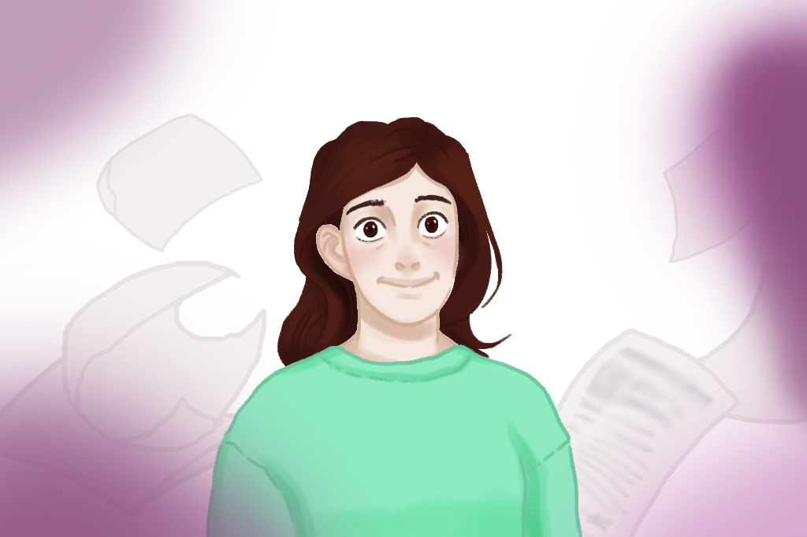

# How to Live

This is a little game in the visual novel genre.

## Plot

Difficulty finding a job, bureaucratic delays, social isolation. A common situation, only brought to the point of absurdity. What you would do?

## Authors

Text, programming, music, some images - Mariia Nebesnaya (me)
Character design, some other images - Diana Mishina

## Little Backstory

I made it as a diploma project when I was studying in Printing and Publishing college.

When I made it, I had little knowledge about programming, only tons of enthusiasm. I wanted to make a game no matter what. This is why I decided to completely rewrite it using the new knowledge I gained.

All the texts in the game are written in Russian. I plan to make an English version in the future.